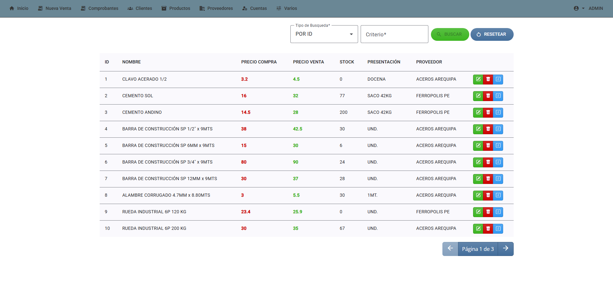
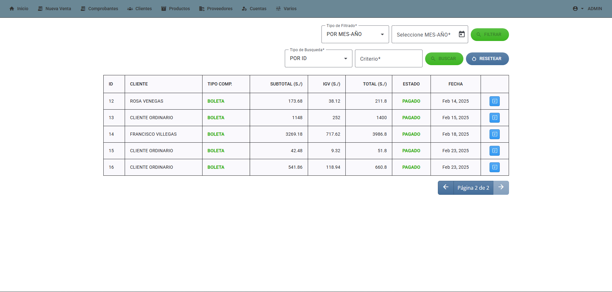
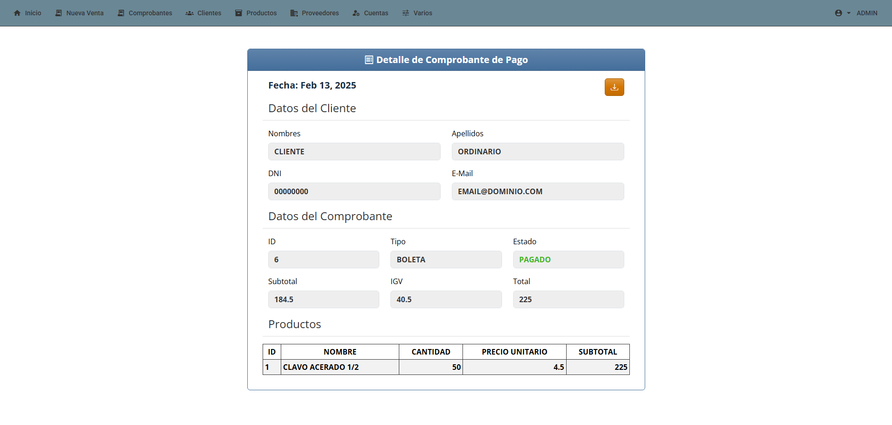
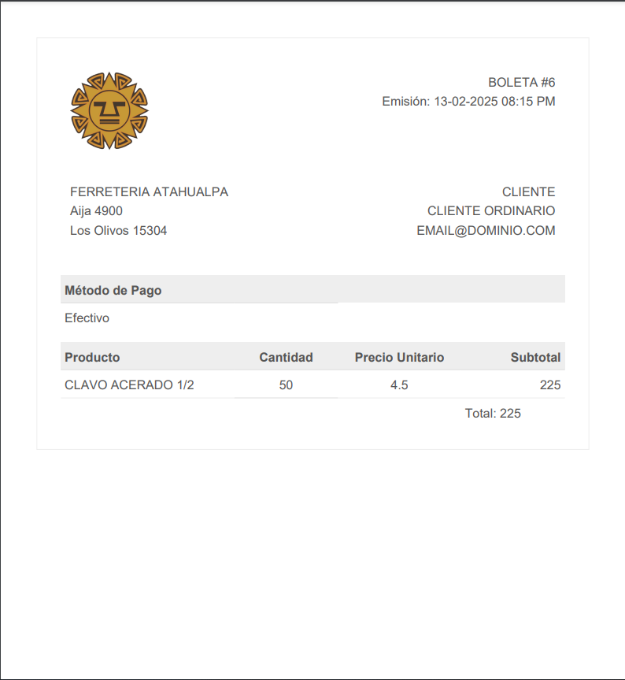
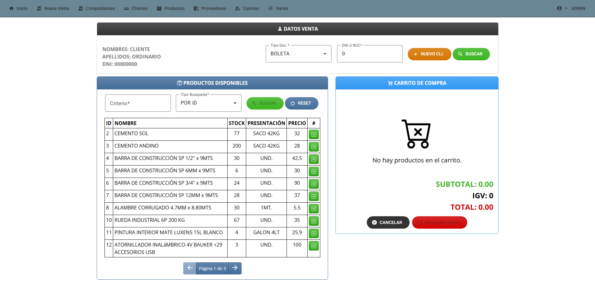
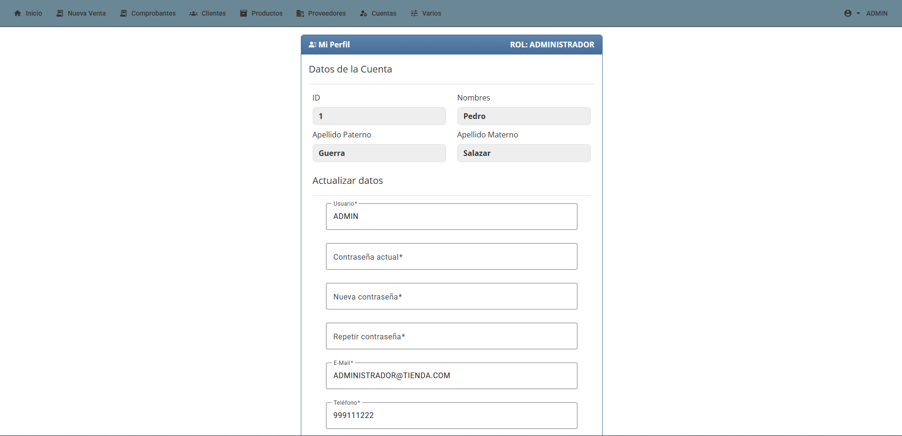

# Descripción
Atahualpa Ferresys es un sistema web simple para la gestión del área de almacén y ventas de un negocio (enfocado en una ferretería). Desarrollado utilizando Laravel 11 y Angular 19.

## Características
- Gestión de productos (CRUD)
- Gestión de proveedores (CRUD)
- Gestión de clientes (CRUD)
- Gestión de presentaciones (CRU)
- Gestión de usuarios del sistema (Crear, eliminar, cambiar permisos y resetear credenciales)
- Módulo simple de ventas
- Visualización, búsqueda y descarga de comprobantes de pago (PDF)
- Recuperación de credenciales de acceso (Envío de e-mail)
- Permisos de acceso al sistema según roles (ADMINISTRADOR/VENDEDOR)

## Tecnologías y dependencias
- Angular 19 (Frontend)
- Laravel 11 (Backend)
- Angular Material (Interfaces)
- Bootstrap 5 (Interfaces)
- Bootswatch Spacelab (Tema para Bootstrap)
- Sweetalert2 (Alertas)
- jwt-auth (Libreria JWT Laravel)

## Uso

Wip....

## Imágenes
Listado de Productos

Listado de Comprobantes

Detalle de Comprobante

Comprobante en PDF

Módulo de Ventas

Perfil de Usuario

